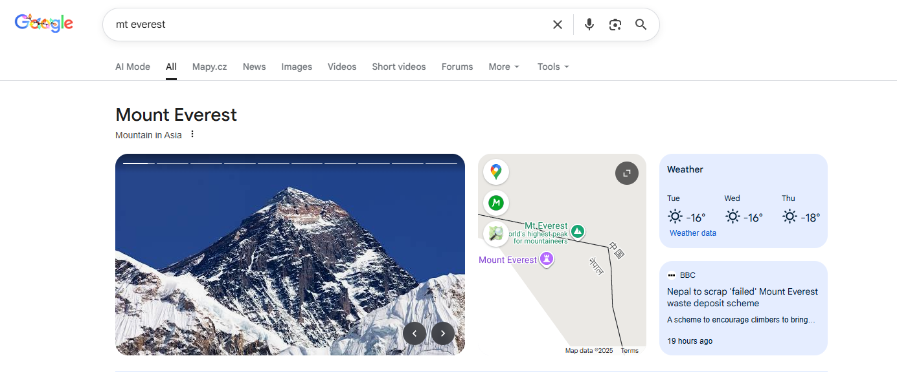
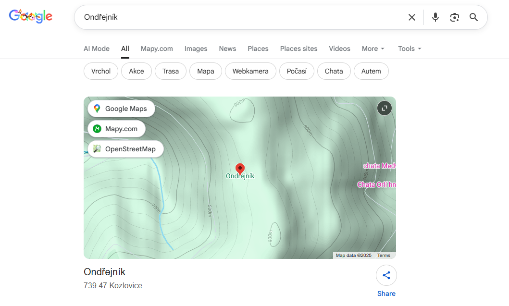
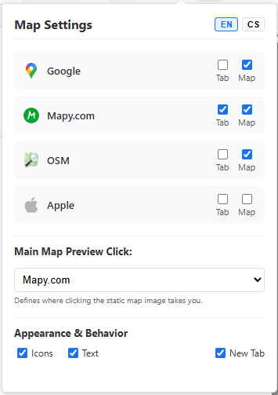

# Google Search Maps Button Restoration

A Chromium-based browser extension (Chrome, Vivaldi, Edge, Brave) that restores the missing "Maps" tab in Google Search (EU region) and integrates alternative map providers like Mapy.com, OpenStreetMap, and Apple Maps.

## Features

* **Restores Google Maps Button:** Adds the "Maps" tab back to the top navigation bar in Google Search.
* **Alternative Providers:** Adds quick access to **Mapy.com**, **OpenStreetMap**, and **Apple Maps**.
* **Knowledge Panel Shortcuts:** Adds floating action buttons directly over the map preview image for quick navigation.
* **Main Click Redirection:** Allows you to change the behavior of clicking the main map preview (e.g., open Mapy.com instead of Google Maps).
* **Customizable:** Toggle providers, change appearance (Icons/Text), and choose language (EN/CS).

## Installation (Developer Mode)

Since this extension is not in the Chrome Web Store, you need to load it manually:

1.  Download or clone this repository to your computer.
2.  Open your browser's Extensions page:
    * **Chrome/Vivaldi/Brave:** `chrome://extensions`
    * **Edge:** `edge://extensions`
3.  Enable **Developer mode** (toggle usually in the top right corner).
4.  Click **Load unpacked**.
5.  Select the folder containing the extension files (where `manifest.json` is located).

## Configuration

You can fully customize the extension behavior. Click the extension icon in your browser toolbar to open the settings:

1.  **Tabs:** Toggle visibility of tabs in the top search menu.
2.  **Map:** Toggle visibility of floating buttons over the map preview.
3.  **Main Map Preview Click:** Select which map service opens when you click the large static map image in search results.
4.  **Appearance:** Switch between **Icons**, **Text**, or both.
5.  **Language:** Switch between English and Czech.

## Supported Map Services

* Google Maps
* Mapy.com (Mapy.cz)
* OpenStreetMap (OSM)
* Apple Maps

## Screenshots
| Main Interface | Map Shortcuts | Settings |
| :---: | :---: | :---: |
|  |  |  |
| *Restored Tab & Buttons* | *Quick access inside Map* | *Fully Customizable* |

## License

This project is open-source. Feel free to modify and distribute.